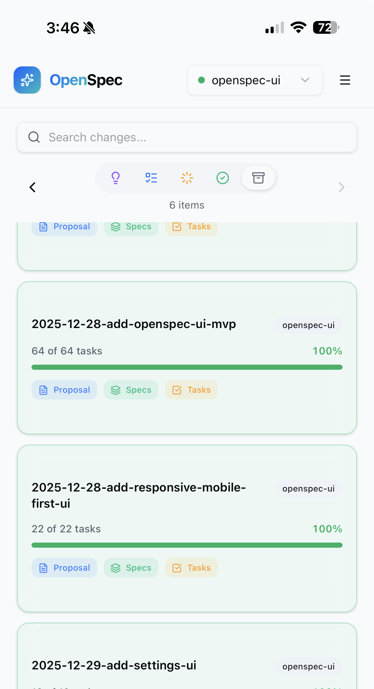

# OpenSpec UI

A dashboard for tracking [OpenSpec](https://github.com/Fission-AI/OpenSpec) changes across multiple repositories. Built for agentic development workflows.

<p align="center">
  
  
</p>
<p align="center"><em>Desktop and mobile views — mobile-first design should work on any device</em></p>

## Why

AI coding assistants are powerful, but when you're working across multiple projects, it's hard to keep track of what's happening where. Which features are in progress? What did the agent finish yesterday? What ideas are waiting to be developed?

OpenSpec UI solves this by giving you a single dashboard to monitor all your AI-assisted projects — capture ideas on the go, watch progress in real-time, and stay in sync with your agents.

## What is OpenSpec?

[OpenSpec](https://github.com/Fission-AI/OpenSpec) is a spec-driven development (SDD) framework for AI coding assistants. Instead of jumping straight into code, you first define **what** should be built through structured proposals and specifications. Your AI agent then implements the spec, task by task.

```
openspec/
├── specs/          # What IS built (source of truth)
├── changes/        # What SHOULD change (proposals + tasks)
└── ideas/          # Quick thoughts to develop later
```

OpenSpec UI reads this structure and displays it as a kanban board.

## What It Does

OpenSpec UI gives you a bird's-eye view of all your AI-assisted projects:

- **Capture ideas** — Quick-capture thoughts that AI agents can later expand into proposals
- **Track progress** — Watch changes move from Ideas → Todo → In Progress → Done
- **Multi-repo visibility** — Monitor multiple OpenSpec repositories from one dashboard
- **Real-time updates** — Auto-refreshes as your agents work through tasks

## The Workflow

```
💡 Idea  →  📋 Proposal  →  ⚡ Implementation  →  ✅ Done
   ↑            ↑                  ↑
  You      AI Agent           AI Agent
```

1. **Capture an idea** in the UI
2. **Work with your AI agent** to expand it into a full OpenSpec proposal
3. **Watch progress** as the agent implements tasks
4. **Archive** completed changes

OpenSpec UI is the mission control — the actual spec-driven development happens through [OpenSpec](https://github.com/Fission-AI/OpenSpec) and your AI coding assistant (Cursor, Claude Code, etc.).

## Installation

### Option 1: Download Binary (Recommended)

Download the latest release from [GitHub Releases](https://github.com/ToruAI/openspec-ui/releases):

| Platform | File |
|----------|------|
| macOS (Apple Silicon) | `openspec-ui-v0.1.0-darwin-aarch64.zip` |
| Linux (x86_64) | `openspec-ui-v0.1.0-linux-x86_64.zip` |
| Windows (x86_64) | `openspec-ui-v0.1.0-windows-x86_64.zip` |

```bash
# Extract and run (Linux/macOS)
unzip openspec-ui-*.zip
./openspec-ui --config openspec-ui.json
```

### Option 2: Docker

```bash
docker build -t openspec-ui .

docker run -p 3000:3000 \
  -v /path/to/your/repos:/repos \
  -v /path/to/openspec-ui.json:/app/openspec-ui.json \
  openspec-ui
```

### Option 3: Build from Source

**Prerequisites:** Rust (stable), Node.js 18+

```bash
# Quick build & run (creates default config if missing)
./build_n_run.sh

# Or step by step:
cd frontend && npm ci && npm run build && cd ..
cd backend && cargo build --release && cd ..
./backend/target/release/openspec-ui --config openspec-ui.json
```

## Configuration

Create `openspec-ui.json`:

```json
{
  "sources": [
    { "name": "my-project", "path": "/path/to/my-project/openspec" },
    { "name": "another-repo", "path": "/path/to/another-repo/openspec" }
  ],
  "port": 3000
}
```

| Field | Description |
|-------|-------------|
| `sources` | Array of OpenSpec directories to monitor |
| `sources[].name` | Display name for the project |
| `sources[].path` | Path to the `openspec/` directory |
| `port` | Server port (default: 3000) |

## Features

- **Kanban Board** — Ideas, Todo, In Progress, Done, Archived columns
- **Specs Browser** — Browse specifications across all repositories
- **Detail View** — View proposals, specs, tasks, and design documents
- **Real-time Updates** — Auto-refreshes when files change (SSE)
- **Mobile-first** — Works great on phone and tablet
- **Light/Dark Theme** — Toggle between themes

## Tech Stack

- **Frontend**: React + TypeScript + Tailwind CSS + shadcn/ui
- **Backend**: Rust (Axum)
- **Real-time**: Server-Sent Events (SSE)

## Related

- [OpenSpec](https://github.com/Fission-AI/OpenSpec) — The spec-driven development framework this UI is built for

## License

MIT
