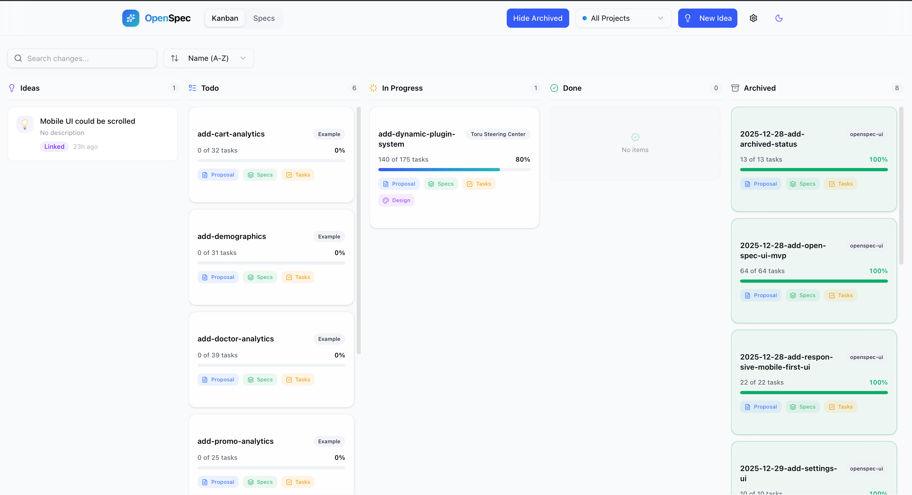

# OpenSpec UI

A read-only dashboard for monitoring OpenSpec changes and specifications across multiple repositories.



## Features

- **Kanban Board**: Visualize changes in columns (Draft → Todo → In Progress → Done)
- **Specs Browser**: Browse all specifications across repositories
- **Detail View**: View full proposal, specs, tasks, and design documents
- **Real-time Updates**: Automatically refreshes when files change
- **Multi-repo Support**: Monitor multiple OpenSpec repositories simultaneously
- **Light/Dark Theme**: Toggle between themes

## Tech Stack

- **Frontend**: Vite + React + TypeScript + Tailwind CSS
- **Backend**: Rust (Axum)
- **Real-time**: Server-Sent Events (SSE)
- **File Watching**: notify + notify-debouncer-mini

## Development

### Prerequisites

- Rust (latest stable)
- Node.js 18+ and npm/bun

### Setup

1. **Backend**:
```bash
cd backend
cargo build
```

2. **Frontend**:
```bash
cd frontend
npm install
npm run build
```

### Running

1. **Create config file** (`openspec-ui.json`):
```json
{
  "sources": [
    {
      "name": "my-repo",
      "path": "./path/to/openspec"
    }
  ],
  "port": 3000
}
```

2. **Start backend**:
```bash
cd backend
cargo run -- --config ../openspec-ui.json
```

3. **Start frontend** (in another terminal):
```bash
cd frontend
npm run dev
```

The frontend dev server will proxy API requests to the backend.

### Production Build

1. Build frontend:
```bash
cd frontend
npm run build
```

2. Run backend (it will serve the frontend from `frontend/dist`):
```bash
cd backend
cargo run --release -- --config openspec-ui.json
```

Or set `FRONTEND_DIR` environment variable to point to a different frontend build directory.

## Configuration

The config file (`openspec-ui.json`) supports:

- `sources`: Array of OpenSpec repositories to monitor
  - `name`: Unique identifier for the source
  - `path`: Path to the OpenSpec directory (relative or absolute)
- `port`: Server port (default: 3000)

Paths can be:
- Absolute: `/Users/tako/repos/my-repo/openspec`
- Relative to config file: `./openspec` or `../other-repo/openspec`

## API Endpoints

- `GET /api/health` - Health check
- `GET /api/sources` - List configured sources
- `GET /api/changes` - List all changes with status
- `GET /api/changes/:id` - Get change detail (id format: `sourceId/changeName`)
- `GET /api/specs` - List all specs
- `GET /api/specs/:id` - Get spec content (id format: `sourceId/specPath`)
- `SSE /api/events` - Real-time file change notifications

## Change Status Logic

| Status | Condition |
|--------|-----------|
| Draft | Has `proposal.md` but NO `tasks.md` |
| Todo | Has `tasks.md`, ALL tasks are `[ ]` |
| In Progress | Has `tasks.md`, SOME `[x]` but not all |
| Done | Located in `archive/` folder OR all tasks completed |

## Project Structure

```
openspec-ui/
├── backend/           # Rust backend
│   ├── src/
│   │   ├── main.rs    # Server & API handlers
│   │   ├── config.rs  # Config loading
│   │   └── parser.rs  # OpenSpec parsing
│   └── Cargo.toml
├── frontend/          # React frontend
│   ├── src/
│   │   ├── components/
│   │   ├── hooks/
│   │   └── types/
│   └── package.json
├── openspec/          # This project's specs
└── example-openspec/  # Test data
```

## License

MIT


