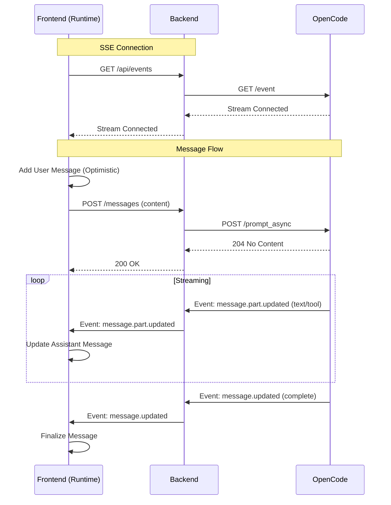

# Design: Streaming Chat Architecture

## Context
OpenCode provides an event stream (`GET /event`) and an async prompt endpoint (`POST /session/:id/prompt_async`). Brain Gate currently uses synchronous polling, causing UI lag and state jumps.

## Goals
- **Real-time feedback**: User sees their message instantly; AI response streams.
- **Robustness**: Reconnect automatically if SSE drops.
- **Simplicity**: Proxy events 1:1 where possible, filtering only what's needed.

## Architecture

## Decisions

### 1. Backend Proxy for SSE
**Decision**: The backend will proxy the OpenCode SSE stream.
**Why**: 
- **CORS**: OpenCode might not allow direct browser connections from a different origin (Brain Gate).
- **Security**: Hides OpenCode address/auth details from the browser.
- **Connectivity**: If OpenCode is on a private network (VPS localhost) and Brain Gate is exposed, direct connection isn't possible.

### 2. Global vs. Session Event Stream
**Decision**: Use a global event stream (`/api/events`) and filter by session ID in the frontend (or backend).
**Details**: OpenCode's `/event` is global. The backend will forward all relevant events. The frontend `runtime.tsx` will filter events matching the current `sessionId`.
**Trade-off**: Slightly more bandwidth if multiple sessions are active, but simpler than managing per-session backend streams.

### 3. Optimistic UI
**Decision**: `onNew` appends the message to local state immediately before the network call.
**Why**: Instant feedback is critical for chat UX.

## Risks
- **Event Ordering**: SSE usually guarantees order, but network glitches could drop events.
- **Mitigation**: On session load/reconnection, fetch full message history to ensure consistency.

## Open Questions
- Does OpenCode send `session_id` in the event payload? (Assumed yes based on `message` object structure).

